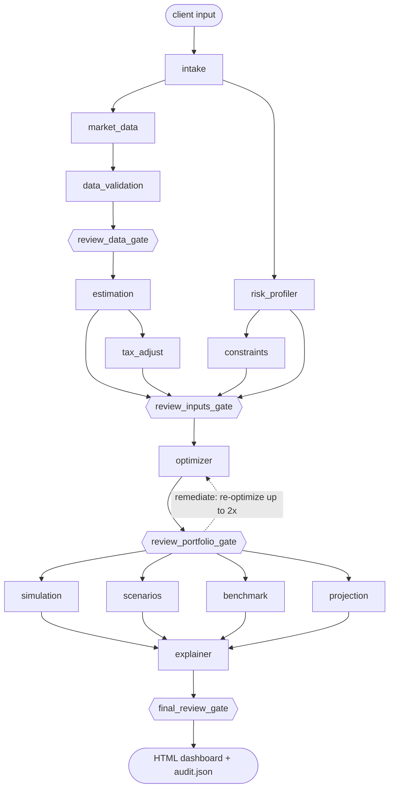

# Architecture

The robo-advisor is a set of single-responsibility **agents** connected by a typed
**workflow graph**. An **independent reviewer agent** sits at four gates in that graph. The
original requirements, extracted from `robo-advisor.docx` with all Word equations converted to
LaTeX, are in [`SPEC.md`](SPEC.md). How to install and run the app is in the
[README](../README.md).

## Advisory graph

`./ra graph` prints the complete, contract-derived graph, with one edge per blackboard key.

Execution waves (nodes within a wave run concurrently):

| Wave | Nodes |
|---|---|
| 0 | intake |
| 1 | market_data ‖ risk_profiler |
| 2 | constraints ‖ data_validation |
| 3 | ◆ review_data_gate (data problems surface as findings before estimation can fail) |
| 4 | estimation |
| 5 | tax_adjust |
| 6 | ◆ review_inputs_gate |
| 7 | optimizer |
| 8 | ◆ review_portfolio_gate |
| 9 | simulation ‖ scenarios ‖ benchmark ‖ projection |
| 10 | explainer |
| 11 | ◆ final_review_gate |

## Graph engine (`robo_advisor/graph/engine.py`)

* **Contracts.** Each node declares `requires` / `provides` (plus `optional`) blackboard
  keys. Edges are *derived* from these declarations. At build time the engine checks that
  every requirement has exactly one producer, that the graph is acyclic, and that every
  remediation target sits upstream of its gate.
* **Isolation.** A node receives a read-only view that contains only its declared keys. It
  must return exactly the keys it provides, or the run fails.
* **Parallelism.** Topological generations run on a thread pool. NumPy releases the GIL, so
  the Monte Carlo, scenario and benchmark agents really do overlap.
* **Provenance.** Every node execution is traced with its wave, attempt, duration, status
  and a SHA-256 digest of each output. The trace goes into the report and into `audit.json`.
* **Gates.** A gate returns a `ReviewReport`. When a report has BLOCKER findings, the engine
  either re-runs the gate's remediation targets with a `remediation` hint (the optimizer
  retries with more solver starts), or raises `GraphHalted`, which carries the partial
  state and the findings.

## Agents (`robo_advisor/agents/`)

| Agent | Spec | Responsibility |
|---|---|---|
| intake | §1, §3, §19 steps 1–2, 4–5 | Validate the input; resolve the client's ETF choice (tickers and/or categories); normalize goal, method and rebalancing |
| risk_profiler | §2 | Capacity and tolerance scored **separately**; mapped = min; band → σ_max |
| market_data | §3, §6 | Fetch selected ETFs + VOO (benchmark) + BIL (risk-free), truncated at the as-of date |
| data_validation | §3 | Inception, 20-year coverage, gaps, split/distribution-consistent adjusted prices, expense ratios |
| estimation | §6 | μ from monthly total returns; σ and Σ from daily returns (pairwise, PSD-repaired); VaR, CVaR, MDD, β, Sharpe, Sortino |
| tax_adjust | §5 | After-tax return series (interest / qualified / REIT / collectibles), gain-realization drag |
| constraints | §4 | Long-only or Σ\|w\| ≤ L shorts; \|wᵢ\| ≤ max position; Σ\|wᵢ\| per category ≤ category limit (config defaults + client overrides); σ ≤ σ_max from the mapped profile |
| optimizer | §7–§9 | Case A: min risk s.t. P(F_T ≥ F\*) ≥ p. Case B: max E[R] s.t. σ ≤ σ_max, or an alternative method |
| simulation | §12 | 10,000-path Monte Carlo with contributions, rebalancing and taxes |
| scenarios | §13 | Conservative / base / optimistic |
| benchmark | §14 | 10-year S&P 500 backtest with identical W0, C, dates and return convention |
| projection | §11 | Deterministic FV_T = W0(1+r)^T + C[((1+r)^T − 1)/r] |
| explainer | §10, §16 | Narrative, per-ETF rationale, risk contributions, calculations, disclosures |
| monitor | §18 | Separate graph: re-assesses a prior audit bundle and raises review triggers |

## Independent reviewer (`robo_advisor/review/`)

The reviewer's own numerics live in `independent.py`. `tests/test_review_isolation.py`
fails if the reviewer imports the production estimation, optimization, simulation,
benchmark, tax or questionnaire code. The reviewer recomputes independently:

* returns from **raw** close, dividends and splits (production uses `adj_close`);
* capacity and tolerance scores from the configured weights, plus the band lookup;
* μ and σ for every ETF;
* its own Monte Carlo with a different seed and a different square-root factorization;
* FV by month-by-month recursion (production uses the closed form);
* the S&P 500 ending wealth by a plain loop over month-end prices;
* an independent re-solve of the Case B objective (max return, max Sharpe or min volatility, with long-only or split shorts);
* a goal-minimality check: the reviewer builds its own lower-risk frontier and scores it with its own MC. If a portfolio with ≥10% lower volatility also reaches p, the run is blocked;
* month-end backtests of **both** benchmark sides, recomputed from raw prices with the same rebalancing rule;
* a distribution-tax lower bound along the median wealth path, which catches a tax engine that silently drops taxes.

Each rule carries an ID, the spec section it enforces, a severity and a pass/fail message
with evidence. The rule families:

| Gate | Rule families |
|---|---|
| data | R-UNIV, R-DATA (no look-ahead, 20-year window, short-history flags, blocking validation findings, independent adjusted-price consistency, expense ratios) |
| inputs | R-RISK (scores, min-mapping, band), R-EST (coverage, μ, σ, PSD Σ), R-TAX, R-CON |
| portfolio | R-PORT: Σw = 1, long-only, max position, gross exposure, category limits (R-PORT-15), σ ≤ σ_max, E[R] and σ reproduce, allocation reconciliation, case-correct objective, **independent re-solve (Case B)**, **goal minimality (Case A)** |
| final | Cheap portfolio rules again, plus R-SIM (paths, percentiles, P(target) and P(loss) consistency, P ≥ p, independent-MC agreement), R-TAX-02, R-PROJ, R-SCN, R-BM (same W0/C/months, 10-year window, independent backtests of both sides), R-EXP (exact score phrases, "historical estimates" label, scenarios ≠ forecasts, tax disclaimer, synthetic watermark, special-risk disclosure for held leveraged / option-income / crypto ETFs) |

When remediation fixes a gate, only the **latest** report of each stage decides the verdict.
Superseded attempts are kept as history in the report and in `audit.json`.

`tests/test_reviewer.py`, `tests/test_audit_regressions.py` and `tests/test_universe.py`
tamper with real run outputs and assert that each change is blocked. The tampering covers:
weights summing to 1.05, a risk-limit breach, look-ahead data, a wrong risk mapping, altered μ,
a sub-optimal or non-minimal-risk portfolio, wrong benchmark wealth or contributions, missing
taxes, missing disclosures and a misreported probability.

## ETF universe and data

* **Universe.** 25 ETFs in 9 categories, defined in `config/default.yaml` (`universe.categories`):

  | Category | ETFs |
  |---|---|
  | Equity | SPY, VOO, VTI, QQQ, TQQQ |
  | Bond | BND, TLT, HYG |
  | Risk-free Short-term Treasury | BIL, SGOV |
  | Commodity | GLD, SLV |
  | International Equity | VXUS, IEFA, VWO |
  | Real Estate | VNQ, SCHH |
  | Dividend | SCHD, VYM, DGRO |
  | Income | SPYI, QQQI, JEPQ, JEPI |
  | Crypto | IBIT |

  `robo_advisor/universe.py` holds each ETF's facts: inception date, expense ratio, tax
  character of its distributions, collectible status (GLD, SLV), and a special-risk note
  (TQQQ, the four income ETFs, IBIT). The config is validated against the catalog. Clients
  choose ETFs by category: the interactive questionnaire goes category by category, and a
  profile file lists tickers and/or category names. There is no implicit "all ETFs" default.
  This list replaces the ETF list in spec §3.
* **Data providers** (`robo_advisor/data/providers.py`):
  - `yahoo` (default): yfinance, normalized to raw prices, repaired, cached, with retries.
  - `csv`: your own price files.
  - `synthetic`: deterministic simulated histories, calibrated per ETF, for offline testing
    (the test suite uses it); reports are watermarked SYNTHETIC.
  - The risk-free rate can come from FRED (`DTB3`) instead of BIL.
* **Benchmark.** VOO (S&P 500 total return) is always fetched for the §14 comparison. BIL is
  always fetched as the T-bill proxy, whether or not the client selected them.

## Key modelling decisions

* **Case A (target).** The minimum-variance frontier runs from the minimum-volatility
  portfolio to the maximum-return portfolio at the risk cap. Each frontier point is scored by
  Monte Carlo with common random numbers, using the same engine as the projection, so the
  initial investment, contributions, rebalancing and taxes all count. The search picks the
  lowest-risk point with P ≥ p + margin and refines it by bisection. It then **verifies** on
  the full 10,000-path sample that the report shows. If verification fails, the search moves
  up the frontier. When no admissible portfolio reaches p, the highest-probability portfolio
  is returned, flagged, along with the monthly contribution needed to reach p. The risk metric
  is volatility (the default) or CVaR of terminal wealth.
* **Case B (no target).** The default is max w′μ s.t. w′Σw ≤ σ_max². Methods whose natural form
  can't carry the quadratic cap (CVaR LP, risk parity, max diversification) are blended toward
  the minimum-volatility portfolio just far enough to satisfy it. The blend stays inside the
  convex feasible set, so every other constraint still holds.
* **Shorts.** The variable split w = p − q keeps the gross-exposure constraint linear.
* **Category limits.** Linear constraints (on p + q with shorts) are added to every method's
  formulation: the SLSQP constraints, rows of the CVaR linear program, and the long-only risk
  parity / max-diversification problems. A feasibility pre-check stops the run with an
  explanation when the chosen ETFs can't reach 100 % under the limits. The reviewer derives
  the expected limits independently and applies them in its own re-solve.
* **Monte Carlo.** Monthly returns are multivariate log-normal, moment-matched *exactly* to
  μ/12 and Σ/12; an iid bootstrap of history is also available. When taxes are on, the engine
  tracks average-cost basis, the ST/LT split by dollar-weighted holding age, loss netting,
  carry-forward, the $3k ordinary offset, annual settlement and optional liquidation.
* **Short histories.** The spec sentence in §3 is truncated. Each ETF uses its maximum
  available history inside the 20-year window. Short histories are flagged in validation, the
  explanation and the report, and covariances use pairwise overlap followed by a nearest-PSD
  repair.
* **Taxes and shorts.** Only long positions have their distributions taxed and added to basis.
  Payments in lieu on shorts are a non-deductible cost that is already in the total return. The
  optimizer prices short legs at the **pre-tax** return, so a short cannot harvest the tax drag
  of the asset it borrows.
* **Conventions.** A month still in progress at the as-of date contributes no monthly return.
  Validation uses an NYSE holiday calendar (Good Friday included).
* **Known simplifications.**
  - The short/long-term split uses a dollar-weighted average acquisition month, not lot-level FIFO.
  - The bootstrap resamples only months in which every selected ETF has data.
  - Selling to pay taxes does not itself realize gains.
  - The reviewer's tax check is a lower bound (distribution taxes), not a full ledger recomputation.
  - Optimizers follow historical estimates, so ETFs with short, strong histories (e.g. IBIT,
    about 2–3 years) are favoured. The per-ETF and per-category limits contain this, and the
    report discloses the risks, but the estimates remain highly uncertain.
