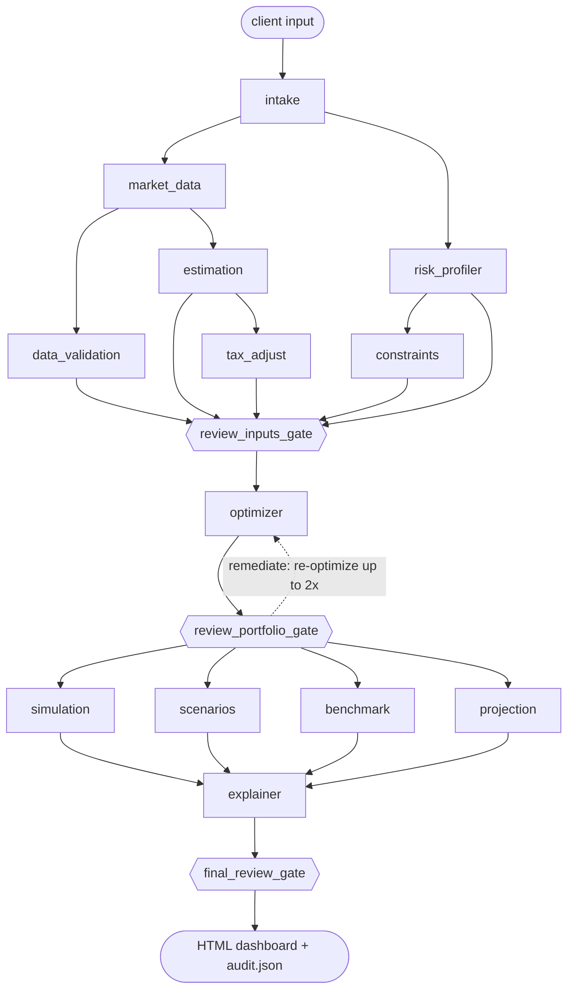

# Architecture

The robo-advisor is a set of single-responsibility **agents** connected by a typed
**workflow graph**. An **independent reviewer agent** sits at three gates in that graph. The
full requirements, extracted from `robo-advisor.docx` with all Word equations converted to
LaTeX, are in [`SPEC.md`](SPEC.md).

## Advisory graph

`robo-advisor graph` prints the complete, contract-derived graph, with one edge per blackboard key.

Execution waves (nodes within a wave run concurrently):

| Wave | Nodes |
|---|---|
| 0 | intake |
| 1 | market_data ‖ risk_profiler |
| 2 | constraints ‖ data_validation ‖ estimation |
| 3 | tax_adjust |
| 4 | ◆ review_inputs_gate |
| 5 | optimizer |
| 6 | ◆ review_portfolio_gate |
| 7 | simulation ‖ scenarios ‖ benchmark ‖ projection |
| 8 | explainer |
| 9 | ◆ final_review_gate |

## Graph engine (`robo_advisor/graph/engine.py`)

* **Contracts.** Each node declares `requires` / `provides` (plus `optional`) blackboard
  keys. Edges are *derived* from these declarations. At build time the engine checks that
  every requirement has exactly one producer, that the graph is acyclic, and that every
  remediation target sits upstream of its gate.
* **Isolation.** A node receives a read-only view that contains only its declared keys. It
  must return exactly the keys it provides, or the run fails.
* **Parallelism.** Topological generations run on a thread pool. NumPy releases the GIL, so
  the Monte Carlo, scenario and benchmark agents really do overlap.
* **Provenance.** Every node execution is traced with its wave, attempt, duration, status
  and a SHA-256 digest of each output. The trace goes into the report and into `audit.json`.
* **Gates.** A gate returns a `ReviewReport`. When a report has BLOCKER findings, the engine
  either re-runs the gate's remediation targets with a `remediation` hint (the optimizer
  retries with more solver starts), or raises `GraphHalted`, which carries the partial
  state and the findings.

## Agents (`robo_advisor/agents/`)

| Agent | Spec | Responsibility |
|---|---|---|
| intake | §1, §19 steps 1–2, 5 | Validate the input; normalize goal, universe, method and rebalancing |
| risk_profiler | §2 | Capacity and tolerance scored **separately**; mapped = min; band → σ_max |
| market_data | §3, §6 | Fetch selected ETFs + VOO (benchmark) + BIL (risk-free), truncated at the as-of date |
| data_validation | §3 | Inception, 20-year coverage, gaps, split/distribution-consistent adjusted prices, expense ratios |
| estimation | §6 | μ from monthly total returns; σ and Σ from daily returns (pairwise, PSD-repaired); VaR, CVaR, MDD, β, Sharpe, Sortino |
| tax_adjust | §5 | After-tax return series (interest / qualified / REIT / collectibles), gain-realization drag |
| constraints | §4 | Long-only or Σ\|w\| ≤ L shorts; \|wᵢ\| ≤ max position; σ ≤ σ_max from the mapped profile |
| optimizer | §7–§9 | Case A: min risk s.t. P(F_T ≥ F\*) ≥ p. Case B: max E[R] s.t. σ ≤ σ_max, or an alternative method |
| simulation | §12 | 10,000-path Monte Carlo with contributions, rebalancing and taxes |
| scenarios | §13 | Conservative / base / optimistic |
| benchmark | §14 | 10-year S&P 500 backtest with identical W0, C, dates and return convention |
| projection | §11 | Deterministic FV_T = W0(1+r)^T + C[((1+r)^T − 1)/r] |
| explainer | §10, §16 | Narrative, per-ETF rationale, risk contributions, calculations, disclosures |
| monitor | §18 | Separate graph: re-assesses a prior audit bundle and raises review triggers |

## Independent reviewer (`robo_advisor/review/`)

The reviewer's own numerics live in `independent.py`. `tests/test_review_isolation.py`
fails if the reviewer imports the production estimation, optimization, simulation,
benchmark, tax or questionnaire code. The reviewer recomputes independently:

* returns from **raw** close, dividends and splits (production uses `adj_close`);
* capacity and tolerance scores from the configured weights, plus the band lookup;
* μ and σ for every ETF;
* its own Monte Carlo with a different seed and a different square-root factorization;
* FV by month-by-month recursion (production uses the closed form);
* the S&P 500 ending wealth by a plain loop over month-end prices;
* an optimality spot-check against thousands of random feasible portfolios.

Each rule carries an ID, the spec section it enforces, a severity and a pass/fail message
with evidence. The rule families:

| Gate | Rule families |
|---|---|
| inputs | R-RISK (scores, min-mapping, band), R-UNIV, R-DATA (no look-ahead, 20-year window, short-history flags, adjusted-price consistency), R-EST (μ, σ, PSD Σ), R-TAX, R-CON |
| portfolio | R-PORT: Σw = 1, long-only, max position, gross exposure, σ ≤ σ_max, E[R] = w′μ and σ = √(w′Σw) reproduce, allocation reconciliation, case-correct objective, optimality spot-check |
| final | All portfolio rules again, plus R-SIM (paths, monotone percentiles, recounted P(target) and P(loss), P ≥ p, independent-MC agreement), R-PROJ, R-SCN, R-BM (same inputs, 10-year window, recomputed S&P wealth), R-EXP (scores shown separately, "historical estimates" label, scenarios ≠ forecasts, tax disclaimer, synthetic watermark, leveraged-ETF disclosure) |

`tests/test_reviewer.py` tampers with real run outputs (weights summing to 1.05, a
risk-limit breach, look-ahead data, a wrong mapping, altered μ, mismatched benchmark
contributions, missing disclosures, a misreported probability) and asserts that each one is
blocked.

## Key modelling decisions

* **Case A (target).** The minimum-variance frontier runs from the minimum-volatility
  portfolio to the maximum-return portfolio at the risk cap. Each frontier point is scored by
  Monte Carlo with common random numbers, using the same engine as the projection, so the
  initial investment, contributions, rebalancing and taxes all count. The search picks the
  lowest-risk point with P ≥ p + margin and refines it by bisection. It then **verifies** on
  the full 10,000-path sample that the report shows. If verification fails, the search moves
  up the frontier. When no admissible portfolio reaches p, the highest-probability portfolio
  is returned, flagged, along with the monthly contribution needed to reach p. The risk metric
  is volatility (the default) or CVaR of terminal wealth.
* **Case B (no target).** The default is max w′μ s.t. w′Σw ≤ σ_max². Methods whose natural form
  can't carry the quadratic cap (CVaR LP, risk parity, max diversification) are blended toward
  the minimum-volatility portfolio just far enough to satisfy it. The blend stays inside the
  convex feasible set, so every other constraint still holds.
* **Shorts.** The variable split w = p − q keeps the gross-exposure constraint linear.
* **Monte Carlo.** Monthly returns are multivariate log-normal, moment-matched *exactly* to
  μ/12 and Σ/12; an iid bootstrap of history is also available. When taxes are on, the engine
  tracks average-cost basis, the ST/LT split by dollar-weighted holding age, loss netting,
  carry-forward, the $3k ordinary offset, annual settlement and optional liquidation.
* **Short histories.** The spec sentence in §3 is truncated. Each ETF uses its maximum
  available history inside the 20-year window. Short histories are flagged in validation, the
  explanation and the report, and covariances use pairwise overlap followed by a nearest-PSD
  repair.
* **Spec inconsistencies handled.** §19 says "20-ETF list" but §3 lists 16, so the default
  universe is those 16. The §10 example uses SGOV, which is therefore an optional extra.
